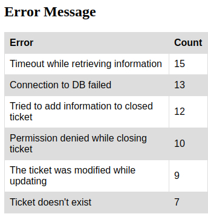
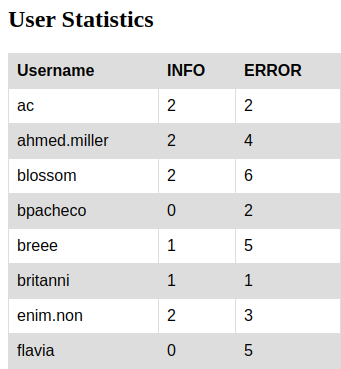

# Write CSV reports from Logfile

On this folder there are two Python scripts ("csv_to_html.py" and "ticky_check.py"), two CSV files ("error_message.csv" and "user_statistics.csv"), two HTML files ("errors.html" and "users.html") and the Logfile being used to extract information ("syslog.log").

**"csv_to_html.py" was not made by the owner of this repository (Sergio-HDEV).**

CSV and HTML are pregenerated by "ticky_check.py" and "csv_to_html.py" respectively.

## How to use

For creating both CSV files run "ticky_check.py".

```bash
./ticky_check.py
```

This will create a CSV file with every error on "syslog.log" and the amount of times it appears, and another CSV with username and count the number of entries for each user (splitting between INFO and ERROR). This files are "error_message.csv" and "user_statistics.csv".

"error_message.csv" columns:

```csv
Error,Count
```

"user_statistics.csv" columns:

```csv
Username,INFO,ERROR
```

### Convert to HTML

"csv_to_html.py" takes two arguments, the CSV file wanted for the transformation and the output HTML.

```bash
./csv_to_html.py error_message.csv error.html
```

```bash
./csv_to_html.py user_statistics.csv users.html
```

Output:




